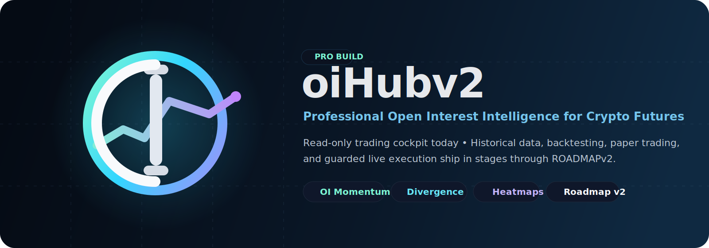
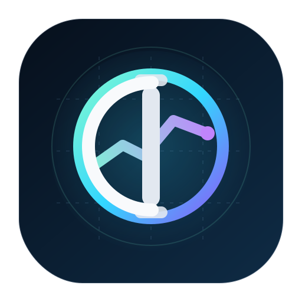

<p align="center">
  
</p>

<p align="center">
  
</p>

<h1 align="center">oiHubv2</h1>
<p align="center"><strong>Professional Open Interest Intelligence for Crypto Futures</strong></p>

<p align="center">
  
  
  
  
  
</p>

oiHubv2 is a professional decision-support dashboard for discretionary and semi-automated crypto futures traders. The current product focuses on **Open Interest (OI), derivatives flow, regime context, and market-structure visualization** so a trader can make faster, better-audited decisions from one cockpit.

> **Current scope:** oiHubv2 is a **read-only analysis platform**. It does **not** place live orders, manage capital, or store trading keys. The long-term direction is staged through an internal Roadmap v2 plan.

---

## Why oiHubv2 exists

Most dashboards stop at price action. oiHubv2 is built around the idea that **Open Interest is the edge**:

- OI helps separate real positioning from noise.
- OI derivatives reveal momentum, acceleration, exhaustion, and forced unwinds.
- OI + price + volume context improves confirmation quality.
- Heatmaps, divergence, funding, and regime analysis help traders see the market as a system, not as isolated candles.

The platform is designed for a **professional OI trader** who wants a serious research and execution-prep workspace rather than a black-box bot.

---

## What the platform does today

### Core capabilities

| Area | What it delivers now |
| --- | --- |
| **OI Momentum & Acceleration** | First/second-derivative analysis for trend continuation, reversals, fake buildup, and liquidation-style moves |
| **OI Divergence** | Shared-window comparison of OI change vs price change for trap and continuation setups |
| **Volume Profile & Bell Curve** | Statistical context around POC, value area, and ±σ extremes |
| **Market Regime Classification** | Risk-aware regime labeling such as healthy, overheated, neutral, and transition |
| **Opportunity Finder** | Multi-signal setup surfacing across the card ecosystem |
| **Heatmaps** | OI, liquidation, and combined market-intensity views |
| **Real-time dashboarding** | Binance Futures public data through REST + WebSocket layers |

### Product characteristics

- **Next.js 15 + TypeScript** application with App Router
- **22+ trading cards** across dashboard, heatmap, and intelligence views
- **TanStack Query + WebSocket** data flow for live analysis
- **Recharts + Tailwind + shadcn/ui** for a professional charting interface
- Domain-first structure in `lib/features`, `lib/api`, `lib/hooks`, and `components/widgets`

---

## Roadmap direction

The repository is intentionally staged from a trading cockpit into a full OI-Trader system:

1. **Phase 0 — Foundation Hardening**  
   Test coverage, WebSocket resilience, centralized Binance client, CI, logging, and cleanup.
2. **Phase 1 — Data Layer & Historical Store**  
   Durable historical storage, backfills, incremental syncs, replay mode, and history APIs.
3. **Phase 2 — Strategy Framework & Backtester**  
   Shared strategy interface, event-driven backtesting, fills/slippage/fees, and report UI.
4. **Phase 3 — Alerting & Signal Automation**  
   Signal-driven alerts across app, browser, Telegram, Discord, and email.
5. **Phase 4 — Paper Trading Simulator**  
   Live market data + simulated broker with persistence and comparison to backtest expectations.
6. **Phase 5 — Guarded Live Execution**  
   Only after kill switches, pre-trade controls, audit logs, reconciliation, and paper-proof maturity.

**No phase skips.** The milestone gates are part of the safety model.

---

## Quick start

```bash
git clone https://github.com/b9b4ymiN/oiHubv2.git
cd oiHubv2
npm install
npm run dev
# http://localhost:3000/dashboard
```

### Canonical commands

```bash
npm run dev         # Local development
npm run build       # Production build
npm start           # Production server
npm run lint        # ESLint
npm run type-check  # TypeScript noEmit
npm test            # Vitest
npm run test:e2e    # Playwright
```

---

## Documentation map

### Read first

- [docs/OI-MOMENTUM-GUIDE.md](docs/OI-MOMENTUM-GUIDE.md) — canonical reference before touching OI momentum logic
- [docs/cards/](docs/cards/) — card-level project documentation

### Product docs

- [docs/cards/](docs/cards/) — per-card documentation
- [docs/cards/core-trading/oi-divergence.md](docs/cards/core-trading/oi-divergence.md) — divergence reference
- [docs/cards/charts/volume-profile.md](docs/cards/charts/volume-profile.md) — volume profile reference
- [docs/cards/intelligence/decision-dashboard.md](docs/cards/intelligence/decision-dashboard.md) — intelligence layer reference

---

## Architecture snapshot

```text
app/                 Next.js routes, pages, and API handlers
components/          Charts, widgets, intelligence components, UI primitives
lib/features/        Pure trading/domain logic
lib/api/             Binance REST/WS clients and related data access
lib/hooks/           Stateful hooks for data + UI integration
types/               Shared domain types
docs/                Card docs, strategy docs, roadmap, and project references
public/brand/        README/logo/banner brand assets
```

### Technology stack

- **Framework:** Next.js 15 (App Router)
- **Language:** TypeScript 5.x strict mode
- **UI:** Tailwind CSS + shadcn/ui + Radix primitives
- **Charts:** Recharts
- **Data layer:** TanStack Query + REST + WebSocket
- **Exchange data:** Binance Futures public endpoints
- **Testing:** Vitest + Playwright

---

## Safety rules that matter

- **No order placement yet.** Live execution is explicitly out of scope until the guarded Phase 5 roadmap work exists.
- **No trading keys in code or logs.** `.env.local` stays local.
- **No fabricated market data.** Fail visibly instead of hiding stale or missing data.
- **No signal-math changes without tests.** Any `lib/features/*` logic change must be covered.
- **UTC milliseconds internally.** Format only at the view layer.

---

## Contributing / working on the repo

Before calling work complete:

```bash
npm run lint
npm run type-check
npm test
# and run Playwright if the UI surface changed
```

Keep diffs small, prefer reuse over new abstractions, and preserve the project's trading-safety constraints.

---

## Risk disclaimer

Cryptocurrency futures trading carries significant risk. oiHubv2 is a research and decision-support platform, not a promise of profit. You remain responsible for your own decisions, risk limits, and execution discipline.
